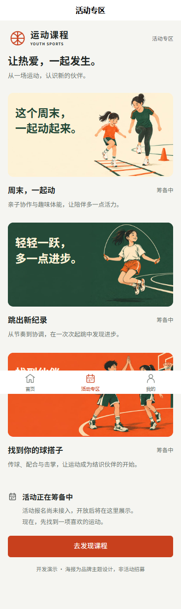
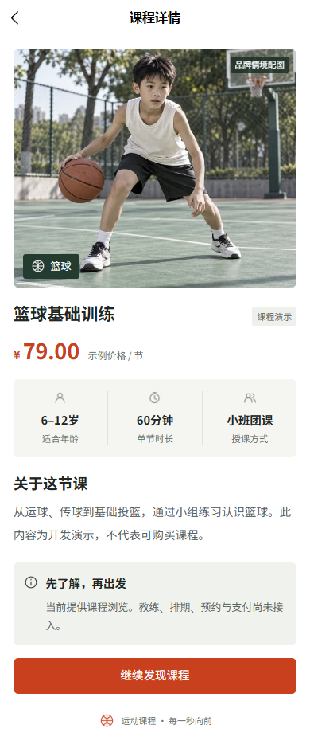

# 青少年运动课程平台

面向儿童与青少年运动课程的微信小程序、管理后台和服务端项目。采用 pnpm workspace 管理，小程序与后台共享同一份课程接口，无需数据库即可启动演示。

这是个人作品集中的三端课程展示原型。重点展示移动端课程发现、后台筛选与详情、共享接口类型及异常恢复，不将当前功能描述为已上线的预约或交易系统。项目展示名称已调整为“青少年运动课程平台”；现有 GitHub 仓库地址和内部包名暂时保留，便于兼容原有运行命令。

查看 [作品案例](docs/PORTFOLIO.md) 了解设计与实现，查看 [本轮优化记录](docs/PORTFOLIO-REVIEW.md) 核对实际验证结果。本轮作品集优化已经用户确认，源码发布不代表已部署可公开访问的网站。

## 界面预览

<p>
  
  
  
</p>

以上截图来自本次 H5 窄屏浏览器验证，展示内容均为开发演示。仓库原有截图保留历史记录，不代表本次微信端实测。

## 已实现功能

- **微信小程序 / H5**：首页、活动专区、个人中心、课程详情；关键词搜索、分类与团课/私教组合筛选；加载、错误重试、空数据和404反馈。
- **品牌与插画**：运动图标标识、运动图标、四张首页轮播，以及亲子运动、跳绳挑战、篮球伙伴三组营销主题插画。轮播支持自动播放、暂停和手动切换。
- **管理后台**：侧栏与工作台、服务连接状态、课程关键词搜索、运动项目与授课方式组合筛选、清空条件与空结果恢复，以及只读课程详情。
- **服务端**：健康检查、演示课程列表/详情、Swagger 文档、可选 MySQL 连接与明确的连接失败反馈。

|模块|技术|
|---|---|
|小程序|uni-app、Vue 3、TypeScript、Pinia、SCSS|
|管理后台|Vue 3、Vite、TypeScript、Vue Router、Element Plus|
|服务端|NestJS、Express、TypeORM、MySQL 驱动|
|接口契约|共享 TypeScript 类型包 `@lemiao/contracts`|

当前交付：三端运行和构建配置、课程列表和详情、后台状态页、错误与重试、MySQL 连接准备。没有 AI、登录、预约、支付、退款、提现或管理写操作，也没有发布上线。

小程序已完成“专业运动训练品牌”视觉改版，包含首页、课程详情、活动、个人中心及反馈状态。素材清单、原图与提示词见 [品牌素材说明](assets/brand/README.md)，界面规范见 [DESIGN.md](DESIGN.md)。课程人物为生成的情境配图，服务端演示数据及业务边界保持不变。

## 环境与启动

使用 Node.js 22.12+ 或 24 LTS，pnpm 11.10.0。当前环境已用 Node.js 24.14.0、pnpm 11.10.0 验证。不要分别在子项目安装不同锁文件。

克隆仓库后，在项目根目录运行：

```powershell
git clone https://github.com/xiaoyu3432-png/lemiao.git
cd lemiao
pnpm install --frozen-lockfile
pnpm dev
```

|入口|地址|
|---|---|
|管理后台|http://127.0.0.1:5173|
|小程序 H5 预览|http://127.0.0.1:5174|
|服务端健康检查|http://127.0.0.1:3000/api/health|
|Swagger 接口文档|http://127.0.0.1:3000/api/docs|

默认仅监听本机，当前没有鉴权，不应作为生产管理系统公开访问。Ctrl+C 停止当前终端启动的开发服务。端口占用会明确报错；若显示端口已使用，先停止之前的项目进程。

## 五分钟体验路线

1. 保持 `pnpm dev` 运行，先打开后台工作台，确认服务连接正常。
2. 在课程示例搜索“篮球”，再选择“一对一”体验组合筛选的空结果；清空条件恢复全部课程。
3. 打开任意课程详情，查看适龄、时长、示例价格与介绍。
4. 打开 H5 预览，尝试分类、搜索与授课方式筛选，再进入同一课程详情，对照后台数据。
5. 进入活动和个人中心查看明确的功能边界。当前未接入报名、账号和支付。

## 微信小程序

保持 `pnpm dev` 运行，在另一个根目录终端运行：

```powershell
pnpm dev:mp-weixin
```

微信开发者工具导入目录：`apps/miniapp/dist/dev/mp-weixin`。生产构建的导入目录为 `apps/miniapp/dist/build/mp-weixin`。应导入编译产物，而不是 `apps/miniapp/src`。

`apps/miniapp/src/manifest.json` 中 `mp-weixin.appid` 留空，填写你自己的微信小程序 AppID 后重新编译。已在微信开发者工具模拟器（基础库 3.16.3、游客 AppID）验证首页加载三门课程、进入篮球详情与返回首页；不代表已通过微信登录、真机或发布审核。

若更新代码后开发者工具出现仅底栏可见的白屏，先清除该项目的编译缓存，再重新编译并打开正确的产物目录。联调中遇到过此现象，清理编译缓存后恢复。`webapi_getwxaasyncsecinfo:fail` 系统日志不能单独证明是业务代码错误，不应通过填写随机 AppID 或改课程数据处理。若只出现“课程加载失败”而页面正常显示，检查 API 进程与开发工具的请求错误。

默认小程序 API 为 `http://127.0.0.1:3000/api`，用于桌面开发工具联调。小程序真机中的127.0.0.1指向手机本身，不能用于访问电脑；真机或发布前须配置可访问的 HTTPS API 和微信合法请求域名。当前源码保留 `urlCheck: true`，没有自动修改微信工具安全设置。

## 命令

|命令|作用|
|---|---|
|`pnpm dev`|构建共用类型并同时启动 API、后台与 H5|
|`pnpm dev:mp-weixin`|微信小程序持续编译；不另外启动 API|
|`pnpm build`|依次构建类型包、API、后台、H5 和微信小程序|
|`pnpm typecheck`|检查四个工作区包的 TypeScript 类型|
|`pnpm lint`|检查 TypeScript、Vue 和配置代码|
|`pnpm test`|服务端 HTTP 契约、异常和配置测试|
|`pnpm --filter @lemiao/api start`|运行已构建的服务端|

修改共用契约后，重新执行 `pnpm --filter @lemiao/contracts build`，或重启根目录开发命令。

## 目录

```text
apps/miniapp/       uni-app Vue 3 + Pinia + SCSS
apps/admin/         Vue 3 + Vite + Element Plus
apps/api/           NestJS + TypeORM + MySQL 驱动
packages/contracts/ 框架无关的公开接口类型
assets/brand/      原创素材原图、图标、提示词与字体许可
docs/screenshots/  README 界面预览
DESIGN.md          小程序视觉规范
PRODUCT.md         产品背景与交付边界
```

`apps/api/src/demo/courses.service.ts` 是唯一的课程示例数据源。活动和个人中心显示明确的尚未接入提示。后台只有工作台和只读课程示例，没有虚构业务数据或可误触的交易按钮。

本地需求调研文档及第三方小程序截图保留在工作目录，不随公开仓库上传。依赖、构建产物、临时验收文件、真实环境变量及微信开发工具私人配置同样不纳入版本控制。

## 环境变量

三个应用均提供 `.env.example`，默认值无需复制即可启动。需要更改时，在对应应用目录复制为 `.env` 并修改，然后重启开发服务。`.env` 不进入版本控制。

服务端：

|变量|默认值或用途|
|---|---|
|`PORT`|3000|
|`HOST`|127.0.0.1|
|`MYSQL_HOST`|留空，不连接数据库|
|`MYSQL_PORT`|配置数据库时默认3306|
|`MYSQL_DATABASE`|数据库名，与HOST、USER一起填写|
|`MYSQL_USER`|数据库用户|
|`MYSQL_PASSWORD`|数据库密码；仅本机开发可按实际情况为空|

所有 `MYSQL_*` 留空时，健康检查返回 `database: not_configured`。填写任意一项后会校验必需参数并尝试连接；配置不完整或连接失败会中止启动，不自动退回无数据库状态。已连接数据库后，健康检查执行 `SELECT 1`；连接失效返回503。

连接层没有实体、没有建表操作，`synchronize` 与 `migrationsRun` 均为false。不会创建数据库、运行迁移、启动本机 MySQL 或写入数据。后续业务阶段再添加实体和显式迁移。

演示接口始终返回演示数据，即使数据库已连接也不会变成业务数据；健康响应中的 `dataSource: demo` 对此作明确区分。

前端：

|变量|用途|
|---|---|
|`VITE_API_BASE_URL`|公开 API 地址，不可填密钥；后台默认 `/api`，小程序H5默认 `/api`，微信端默认本机接口|
|`API_PROXY_TARGET`|Vite开发代理目标，默认 `http://127.0.0.1:3000`；此变量不暴露给客户端|

H5 与后台开发请求均通过同源代理。生产静态构建不自带代理，部署时需为 `/api` 配置反向代理；本轮不包含部署。

## 接口与类型

|方法与路径|响应|
|---|---|
|`GET /api/health`|服务、数据库状态和数据来源|
|`GET /api/demo/courses`|三门课程演示数据|
|`GET /api/demo/courses/:id`|对应课程，不存在返回404|

成功响应为 `{ data: T }`，失败使用 NestJS 标准HTTP错误响应与正确状态码。课程的 `priceCents` 是整数分，前端转换成人民币金额展示。公开类型统一来自 `@lemiao/contracts`，不将数据库实体或 NestJS 类暴露给前端。

## 模板与依赖说明

小程序源自 DCloud 官方 `uni-preset-vue` 的 `vite-ts` 分支，初始化参考提交 `6fb81ac3c5736b8b0a83e667b3ed90223d458dd8`。保留官方CLI入口和编译器配置，仅保留微信、H5所需平台依赖。

- DCloud编译器系列统一固定为 `3.0.0-5020420260813003`。
- 小程序使用Vue 3.4.21，匹配该编译器内置渲染器；后台独立使用Vue 3.5。
- 小程序显式声明Vue Router 4.4.4及Vue Shared 3.4.21，防止解析到项目目录外的其他版本。
- 对 `unplugin-auto-import` 的可选 VueUse 依赖限制到Vue 3.4兼容版本，避免无上限依赖自动拉入仅支持Vue 3.5的版本。
- pnpm只允许必要的esbuild、vue-demi安装脚本；其他无需执行的遥测或提示脚本已禁用。
- 编译器可能输出Sass旧接口或依赖弃用提示；当前构建可用。升级时应整套升级DCloud依赖并重新验证微信与H5，不单独升级Vue或Vite。

参考：[uni-app CLI 文档](https://uniapp.dcloud.net.cn/quickstart-cli.html)、[官方模板](https://github.com/dcloudio/uni-preset-vue/tree/vite-ts)、[NestJS](https://docs.nestjs.com/)。

## 后续开发边界

原需求中的真实账号、教练、班次、预约、资金、邀请分成等不在此次骨架内。正式接入前，应先确认需求文档中的待定规则，增加权限、实体及迁移，再替换显式演示接口；不把当前开发接口直接当作业务接口上线。
