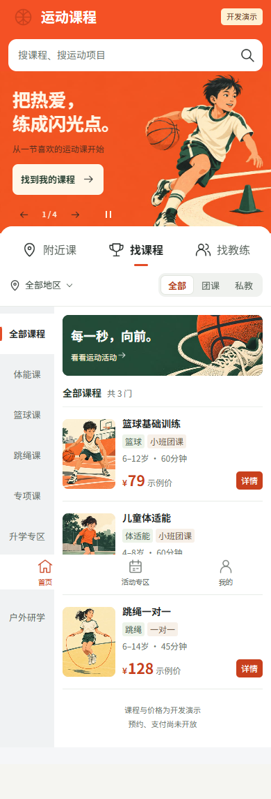
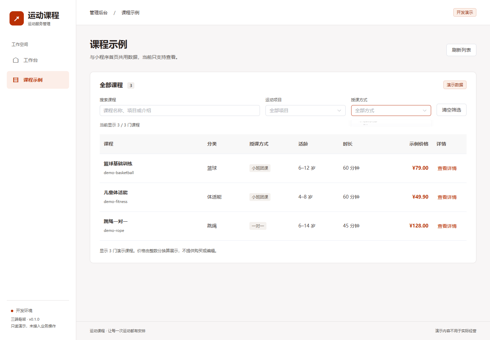
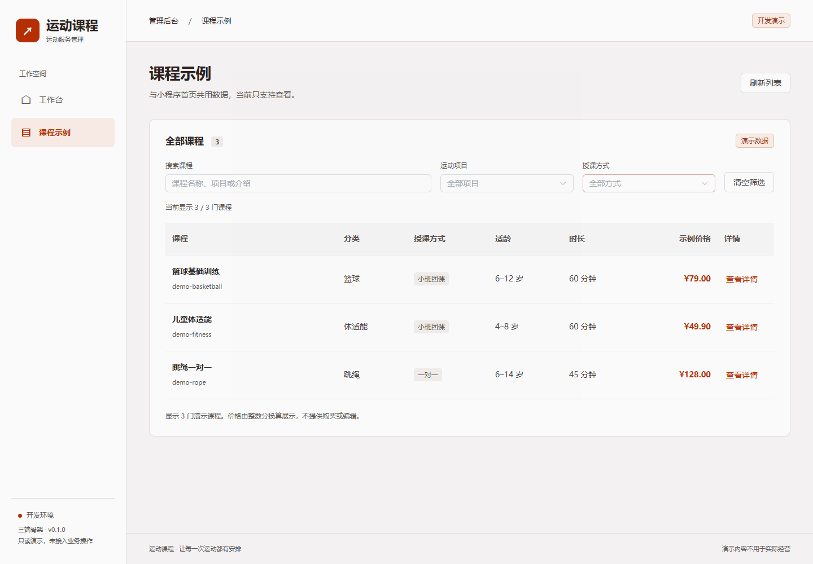

# 青少年运动课程平台作品案例

这个项目面向家长和课程运营人员，使用小程序与 H5 展示青少年运动课程，通过管理后台查看同一批课程和服务状态。当前是可运行的课程展示原型，包含完整的读取、筛选、详情及异常反馈路径。

## 项目结构与设计

移动端采用 uni-app、Vue 3 和 Pinia，后台采用 Vue 3、Element Plus 和 Vite，服务端采用 NestJS。三端用 pnpm workspace 管理，共享框架无关的 TypeScript 接口类型。

课程数据只在服务端定义一次。小程序和后台显示相同的课程名称、年龄、时长和价格，避免在两个前端各写一套示例。金额在接口中以整数分表示，页面换算后展示。

## 可以实际体验的功能

- 移动端课程搜索、项目分类、授课方式组合筛选和课程详情。
- 原有运动插画、自动轮播及手动切换，沿用一致的移动端视觉规范。
- 后台课程筛选、无结果提示、恢复全部课程与详情对话框。
- 请求加载、失败重试、未找到课程及尚未接入功能的明确反馈。
- 服务健康检查、Swagger 接口说明，以及可选 MySQL 连接状态。

## 关键实现

| 问题 | 项目处理方式 |
| --- | --- |
| 前后台数据容易不一致 | 同一 NestJS 课程服务与共享公开类型 |
| 多个请求可能覆盖最新结果 | 前端按请求版本忽略过期响应 |
| 筛选无结果后访客容易卡住 | 展示条件匹配数量，提供清空筛选和查看全部课程 |
| 空数据库容易造成启动困难 | 不配置数据库也能浏览演示课程；部分配置或连接失败会明确报错 |
| 原型容易被误解为真实产品 | 全程标注演示数据，不显示可购买、可报名的假操作 |

## 界面展示

## 功能边界

当前没有真实账户、预约、支付、退款或管理写操作。数据库连接只是基础设施准备，演示课程不会因为数据库连接成功而变成真实业务数据。项目展示名称已去掉临时品牌名，旧仓库地址与内部包标识用于保持兼容。

## 简历表述草稿

构建青少年运动课程展示原型，使用 uni-app、Vue 3 与 NestJS 连接小程序、H5 和管理后台；通过 pnpm workspace 与共享 TypeScript 契约统一课程数据，完善组合筛选、课程详情及请求异常恢复，并完成三端构建与本地浏览器验证。

请按个人实际承担的设计、开发和 AI 辅助工作调整职责表述。验证详情见本轮优化记录，不将历史截图等同于本次微信真机验证。
